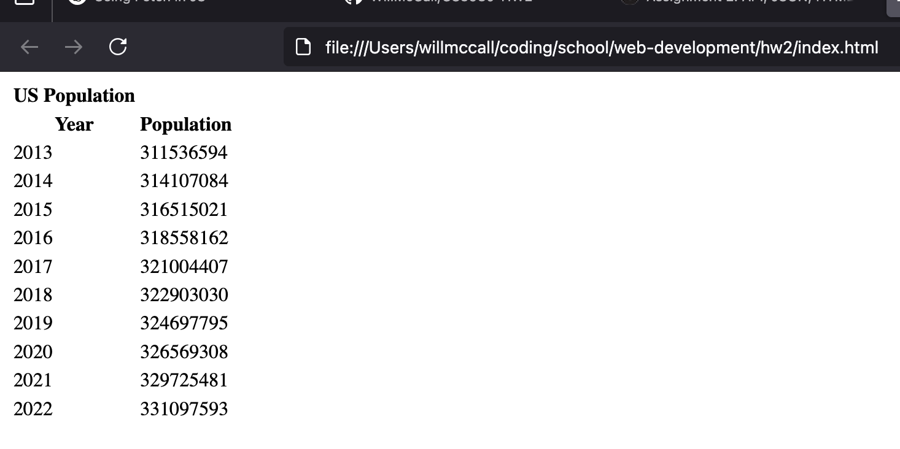
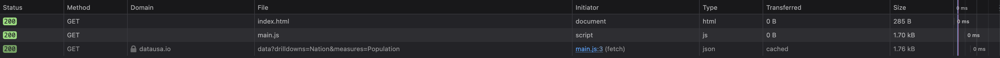

# CS3980 HW2

### Screenshot of my page:

### Screenshot of the network logs:

I did this homework as simply as I could to avoid any confusion.
I didn't style anything on my webpage and rendered the table dynamically using Javascript instead of defining the table manually using HTML and using JS to fill in each cell
